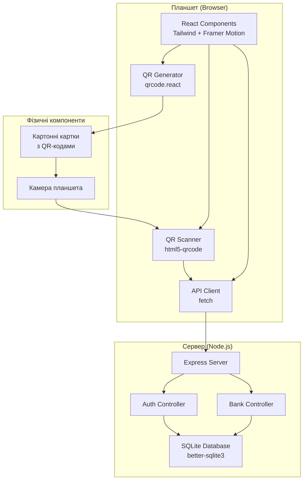
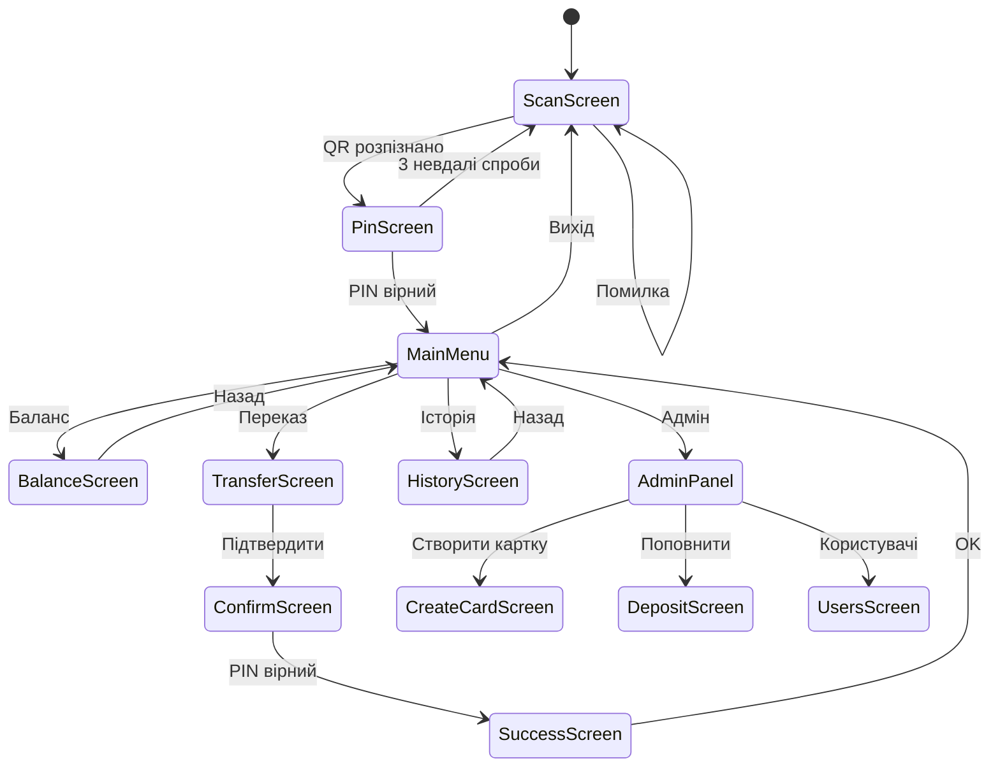

# Design Document: Home Bank System

## Overview

Домашня банківська система — це веб-додаток для планшета, що імітує роботу банкомату. Система використовує камеру планшета для сканування QR-кодів з картонних карток замість NFC. Архітектура клієнт-сервер з SQLite базою даних.

Технологічний стек:
- **Frontend**: React 18 + TypeScript + Vite
- **Backend**: Node.js + Express + better-sqlite3
- **Styling**: Tailwind CSS + Framer Motion (анімації)
- **QR Scanner**: html5-qrcode бібліотека
- **QR Generator**: qrcode.react бібліотека
- **Database**: SQLite (better-sqlite3)
- **API**: REST API

## Architecture



### Project Structure

```
home-bank/
├── client/                    # React Frontend
│   ├── src/
│   │   ├── components/
│   │   │   ├── screens/
│   │   │   │   ├── ScanScreen.tsx
│   │   │   │   ├── PinScreen.tsx
│   │   │   │   ├── MainMenu.tsx
│   │   │   │   ├── BalanceScreen.tsx
│   │   │   │   ├── TransferScreen.tsx
│   │   │   │   ├── HistoryScreen.tsx
│   │   │   │   └── admin/
│   │   │   │       ├── AdminPanel.tsx
│   │   │   │       ├── CreateCard.tsx
│   │   │   │       ├── DepositScreen.tsx
│   │   │   │       └── UsersScreen.tsx
│   │   │   ├── ui/
│   │   │   │   ├── Button.tsx
│   │   │   │   ├── Card.tsx
│   │   │   │   ├── PinPad.tsx
│   │   │   │   ├── AmountInput.tsx
│   │   │   │   └── TransactionItem.tsx
│   │   │   └── QRScanner.tsx
│   │   ├── api/
│   │   │   └── client.ts       # API client
│   │   ├── store/
│   │   │   └── appStore.ts     # Zustand (UI state only)
│   │   ├── utils/
│   │   │   ├── qr.ts
│   │   │   └── format.ts
│   │   └── types/
│   │       └── index.ts
│   └── package.json
│
├── server/                    # Node.js Backend
│   ├── src/
│   │   ├── index.ts           # Express entry
│   │   ├── db/
│   │   │   ├── schema.sql     # SQLite schema
│   │   │   └── database.ts    # DB connection
│   │   ├── controllers/
│   │   │   ├── auth.ts
│   │   │   ├── bank.ts
│   │   │   └── admin.ts
│   │   ├── middleware/
│   │   │   └── auth.ts        # JWT middleware
│   │   └── utils/
│   │       └── crypto.ts
│   ├── data/
│   │   └── bank.db            # SQLite database file
│   └── package.json
│
└── package.json               # Root package.json (workspaces)
```

## Components and Interfaces

### 1. Database Schema (SQLite)

```sql
-- server/src/db/schema.sql

CREATE TABLE users (
  id TEXT PRIMARY KEY,
  name TEXT NOT NULL,
  pin_hash TEXT NOT NULL,
  balance INTEGER NOT NULL DEFAULT 0,  -- в копійках
  is_admin INTEGER NOT NULL DEFAULT 0,
  is_blocked INTEGER NOT NULL DEFAULT 0,
  blocked_until INTEGER,
  failed_attempts INTEGER NOT NULL DEFAULT 0,
  card_number TEXT NOT NULL,
  created_at INTEGER NOT NULL DEFAULT (strftime('%s', 'now'))
);

CREATE TABLE transactions (
  id TEXT PRIMARY KEY,
  from_user_id TEXT,
  to_user_id TEXT NOT NULL,
  amount INTEGER NOT NULL,
  type TEXT NOT NULL CHECK (type IN ('transfer', 'deposit', 'withdrawal')),
  description TEXT,
  created_at INTEGER NOT NULL DEFAULT (strftime('%s', 'now')),
  FOREIGN KEY (from_user_id) REFERENCES users(id),
  FOREIGN KEY (to_user_id) REFERENCES users(id)
);

CREATE INDEX idx_transactions_from ON transactions(from_user_id);
CREATE INDEX idx_transactions_to ON transactions(to_user_id);
CREATE INDEX idx_transactions_created ON transactions(created_at DESC);
```

### 2. TypeScript Types (Shared)

```typescript
// types/index.ts
export interface User {
  id: string;
  name: string;
  balance: number;        // в копійках
  isAdmin: boolean;
  isBlocked: boolean;
  blockedUntil: number | null;
  failedAttempts: number;
  cardNumber: string;     // останні 4 цифри
}

export interface Transaction {
  id: string;
  fromUserId: string | null;
  toUserId: string;
  amount: number;
  type: 'transfer' | 'deposit' | 'withdrawal';
  description: string;
  createdAt: number;
}

export interface LoginRequest {
  qrData: string;
  pin: string;
}

export interface LoginResponse {
  success: boolean;
  token?: string;
  user?: User;
  error?: string;
}

export interface TransferRequest {
  toUserId: string;
  amount: number;
  pin: string;
}

export interface ApiResponse<T> {
  success: boolean;
  data?: T;
  error?: string;
}
```

### 3. REST API Endpoints

```typescript
// API Routes

// Auth
POST /api/auth/login        // { qrData, pin } -> { token, user }
POST /api/auth/logout       // Invalidate token
GET  /api/auth/me           // Get current user

// Bank Operations
GET  /api/bank/balance      // Get balance
POST /api/bank/transfer     // { toUserId, amount, pin }
GET  /api/bank/history      // Get transactions
GET  /api/bank/users        // Get all users (for transfer list)

// Admin (requires admin role)
POST /api/admin/deposit     // { userId, amount }
POST /api/admin/create-user // { name, pin, isAdmin? }
GET  /api/admin/users       // Get all users with balances
DELETE /api/admin/user/:id  // Delete user
```

### 4. Backend Controllers

```typescript
// server/src/controllers/auth.ts
import { db } from '../db/database';
import { hashPin, verifyPin } from '../utils/crypto';
import jwt from 'jsonwebtoken';

export async function login(qrData: string, pin: string) {
  const userId = decodeQR(qrData);
  if (!userId) return { success: false, error: 'Invalid QR code' };
  
  const user = db.prepare('SELECT * FROM users WHERE id = ?').get(userId);
  if (!user) return { success: false, error: 'User not found' };
  
  if (user.is_blocked && user.blocked_until > Date.now()) {
    return { success: false, error: 'Card blocked' };
  }
  
  const valid = await verifyPin(pin, user.pin_hash);
  if (!valid) {
    // Increment failed attempts
    const attempts = user.failed_attempts + 1;
    if (attempts >= 3) {
      db.prepare('UPDATE users SET is_blocked = 1, blocked_until = ?, failed_attempts = ? WHERE id = ?')
        .run(Date.now() + 5 * 60 * 1000, attempts, userId);
      return { success: false, error: 'Card blocked for 5 minutes' };
    }
    db.prepare('UPDATE users SET failed_attempts = ? WHERE id = ?').run(attempts, userId);
    return { success: false, error: 'Invalid PIN' };
  }
  
  // Reset failed attempts
  db.prepare('UPDATE users SET failed_attempts = 0, is_blocked = 0 WHERE id = ?').run(userId);
  
  const token = jwt.sign({ userId, isAdmin: user.is_admin }, process.env.JWT_SECRET!);
  return { success: true, token, user: mapUser(user) };
}

// server/src/controllers/bank.ts
export function transfer(fromUserId: string, toUserId: string, amount: number) {
  const fromUser = db.prepare('SELECT * FROM users WHERE id = ?').get(fromUserId);
  const toUser = db.prepare('SELECT * FROM users WHERE id = ?').get(toUserId);
  
  if (!fromUser || !toUser) return { success: false, error: 'User not found' };
  if (fromUser.balance < amount) return { success: false, error: 'Insufficient funds' };
  
  const txId = crypto.randomUUID();
  
  db.transaction(() => {
    db.prepare('UPDATE users SET balance = balance - ? WHERE id = ?').run(amount, fromUserId);
    db.prepare('UPDATE users SET balance = balance + ? WHERE id = ?').run(amount, toUserId);
    db.prepare(`
      INSERT INTO transactions (id, from_user_id, to_user_id, amount, type, description)
      VALUES (?, ?, ?, ?, 'transfer', ?)
    `).run(txId, fromUserId, toUserId, amount, `Transfer to ${toUser.name}`);
  })();
  
  return { success: true, transactionId: txId };
}
```

### 5. API Client (Frontend)

```typescript
// client/src/api/client.ts
const API_URL = 'http://localhost:3001/api';

class ApiClient {
  private token: string | null = null;
  
  setToken(token: string) {
    this.token = token;
    localStorage.setItem('token', token);
  }
  
  clearToken() {
    this.token = null;
    localStorage.removeItem('token');
  }
  
  private async request<T>(path: string, options?: RequestInit): Promise<ApiResponse<T>> {
    const res = await fetch(`${API_URL}${path}`, {
      ...options,
      headers: {
        'Content-Type': 'application/json',
        ...(this.token && { Authorization: `Bearer ${this.token}` }),
        ...options?.headers,
      },
    });
    return res.json();
  }
  
  // Auth
  async login(qrData: string, pin: string) {
    return this.request<LoginResponse>('/auth/login', {
      method: 'POST',
      body: JSON.stringify({ qrData, pin }),
    });
  }
  
  // Bank
  async getBalance() {
    return this.request<{ balance: number }>('/bank/balance');
  }
  
  async transfer(toUserId: string, amount: number, pin: string) {
    return this.request<{ transactionId: string }>('/bank/transfer', {
      method: 'POST',
      body: JSON.stringify({ toUserId, amount, pin }),
    });
  }
  
  async getHistory() {
    return this.request<Transaction[]>('/bank/history');
  }
  
  async getUsers() {
    return this.request<User[]>('/bank/users');
  }
  
  // Admin
  async deposit(userId: string, amount: number) {
    return this.request('/admin/deposit', {
      method: 'POST',
      body: JSON.stringify({ userId, amount }),
    });
  }
  
  async createUser(name: string, pin: string, isAdmin = false) {
    return this.request<User>('/admin/create-user', {
      method: 'POST',
      body: JSON.stringify({ name, pin, isAdmin }),
    });
  }
}

export const api = new ApiClient();
```

### 6. QR Utils

```typescript
// client/src/utils/qr.ts
const SECRET = 'homebank-2024';

interface QRPayload {
  v: number;
  id: string;
  sig: string;
}

export function encodeQR(userId: string): string {
  const sig = generateChecksum(userId);
  const payload: QRPayload = { v: 1, id: userId, sig };
  return JSON.stringify(payload);
}

export function decodeQR(data: string): string | null {
  try {
    const payload: QRPayload = JSON.parse(data);
    if (payload.v !== 1) return null;
    if (!verifyChecksum(payload.id, payload.sig)) return null;
    return payload.id;
  } catch {
    return null;
  }
}

function generateChecksum(id: string): string {
  const str = id + SECRET;
  let hash = 0;
  for (let i = 0; i < str.length; i++) {
    hash = ((hash << 5) - hash) + str.charCodeAt(i);
    hash |= 0;
  }
  return Math.abs(hash).toString(36).slice(0, 8);
}

function verifyChecksum(id: string, sig: string): boolean {
  return generateChecksum(id) === sig;
}
```

### 7. Format Utils

```typescript
// client/src/utils/format.ts
export function formatAmount(kopecks: number): string {
  const hryvnias = kopecks / 100;
  return new Intl.NumberFormat('uk-UA', {
    style: 'currency',
    currency: 'UAH',
    minimumFractionDigits: 2
  }).format(hryvnias);
}

export function formatDate(timestamp: number): string {
  return new Intl.DateTimeFormat('uk-UA', {
    day: '2-digit',
    month: '2-digit',
    year: 'numeric',
    hour: '2-digit',
    minute: '2-digit'
  }).format(new Date(timestamp * 1000));
}
```

## Data Models

### QR Code Format

QR-код містить JSON з підписом для безпеки:

```json
{
  "v": 1,
  "id": "user-uuid-here",
  "sig": "simple-checksum"
}
```

Checksum = перші 8 символів від base64(id + secret_key)

### localStorage Structure

```json
{
  "homebank_data": {
    "version": 1,
    "users": [...],
    "transactions": [...]
  }
}
```

## Correctness Properties

*A property is a characteristic or behavior that should hold true across all valid executions of a system—essentially, a formal statement about what the system should do. Properties serve as the bridge between human-readable specifications and machine-verifiable correctness guarantees.*

### Property 1: QR Code Round-Trip

*For any* valid user ID, encoding it into a QR code and then decoding the QR code should return the same user ID.

**Validates: Requirements 1.1, 7.4**

### Property 2: PIN Verification Consistency

*For any* user and PIN combination, if the PIN matches the stored hash, authentication should succeed; otherwise it should fail.

**Validates: Requirements 1.3**

### Property 3: Balance Format Correctness

*For any* numeric balance value, the formatted string should contain the correct thousands separators and currency symbol.

**Validates: Requirements 2.3**

### Property 4: Transfer Invariant (Conservation of Money)

*For any* transfer operation between two users, the total sum of all balances in the system should remain unchanged (money is neither created nor destroyed).

**Validates: Requirements 3.2, 3.4**

### Property 5: Insufficient Funds Rejection

*For any* transfer where the amount exceeds the sender's balance, the transfer should be rejected and no balances should change.

**Validates: Requirements 3.3**

### Property 6: Transaction History Ordering

*For any* user's transaction history, transactions should be sorted in descending chronological order (newest first).

**Validates: Requirements 4.1**

### Property 7: Transaction Display Completeness

*For any* transaction, the rendered display should contain the date, amount, type, and counterparty information.

**Validates: Requirements 4.2**

### Property 8: QR Code Uniqueness

*For any* two different users, their generated QR codes should be different.

**Validates: Requirements 5.3, 7.1**

### Property 9: Data Persistence (SQLite)

*For any* valid transaction, after it's committed to the database, querying the transactions table should return that transaction with all fields intact.

**Validates: Requirements 5.5**

### Property 10: Admin Deposit Increases Balance

*For any* admin deposit operation with a positive amount, the target user's balance should increase by exactly that amount.

**Validates: Requirements 5.2**

## Error Handling

| Помилка | Код | Повідомлення | Дія |
|---------|-----|--------------|-----|
| QR не розпізнано | E001 | "Не вдалося розпізнати картку" | Показати повідомлення, повторити сканування |
| Невірний PIN | E002 | "Невірний PIN-код" | Показати помилку, інкремент спроб |
| Картка заблокована | E003 | "Картка заблокована на X хв" | Показати час розблокування |
| Недостатньо коштів | E004 | "Недостатньо коштів" | Показати поточний баланс |
| Користувач не знайдений | E005 | "Користувача не знайдено" | Повернутися до сканування |
| Помилка збереження | E006 | "Помилка збереження даних" | Повторити операцію |

## Testing Strategy

### Unit Tests

Фокус на критичних функціях:
- `hashPin()` / `verifyPin()` — коректність хешування
- `formatAmount()` — форматування сум
- `encodeQR()` / `decodeQR()` — кодування/декодування
- API controllers — transfer, deposit, login
- Database operations — CRUD

### Property-Based Tests

Використовуємо **fast-check** бібліотеку для TypeScript/JavaScript.

Кожен property test повинен:
- Виконуватися мінімум 100 ітерацій
- Мати тег з номером властивості
- Посилатися на вимоги

Приклад тегу: `// Feature: home-bank-system, Property 1: QR Code Round-Trip`

### Integration Tests

Використовуємо **Vitest** + **supertest** для API тестів:
- Повний flow авторизації: scan → PIN → token
- Повний flow переказу: auth → transfer → verify balances
- Адмін flow: auth → create user → deposit

## UI Screens



## Card Design Guide

### Розміри картки
- Ширина: 85.6 мм (стандарт банківської картки)
- Висота: 53.98 мм
- Кути: заокруглені (радіус 3 мм)

### Макет картки

```
┌─────────────────────────────────────┐
│  🏦 HOME BANK                       │
│                                     │
│     ┌─────────┐                     │
│     │ QR CODE │     Ім'я Прізвище   │
│     │         │                     │
│     └─────────┘     **** **** 1234  │
│                                     │
└─────────────────────────────────────┘
```

### Інструкція виготовлення
1. Роздрукувати QR-код на папері
2. Вирізати за розмірами 85.6 × 54 мм
3. Наклеїти на картон товщиною 0.76 мм
4. Заламінувати (опціонально)
5. Заокруглити кути

